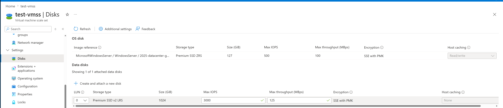
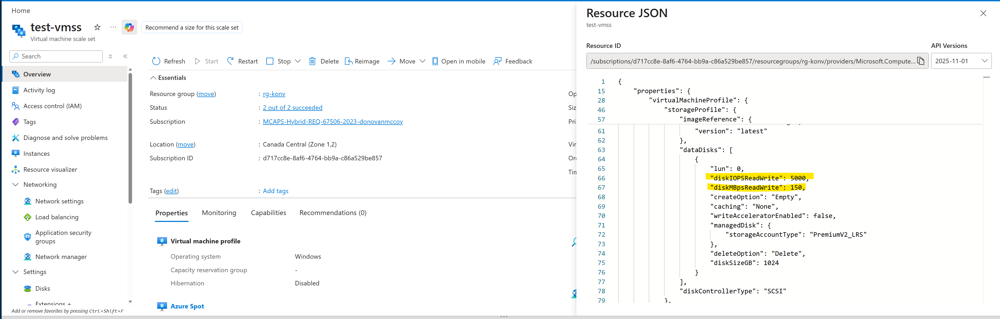
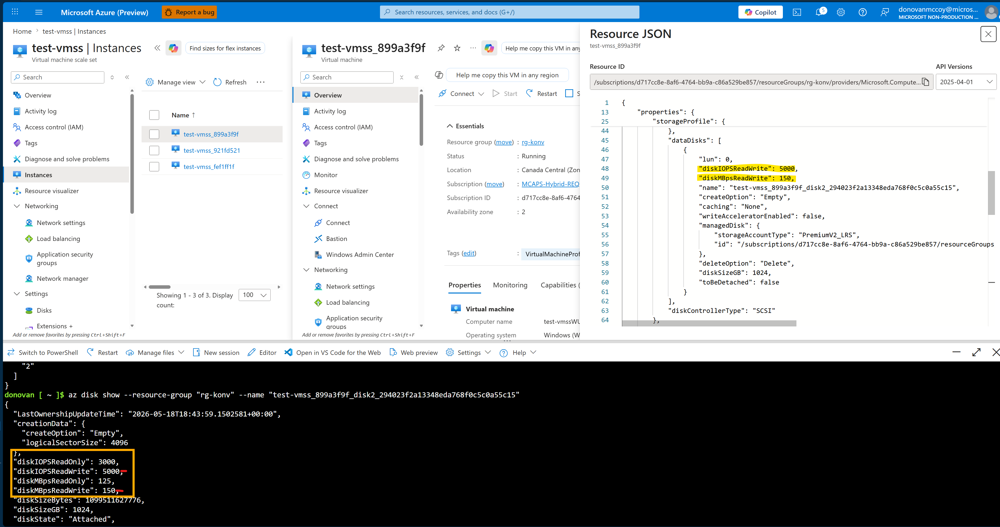
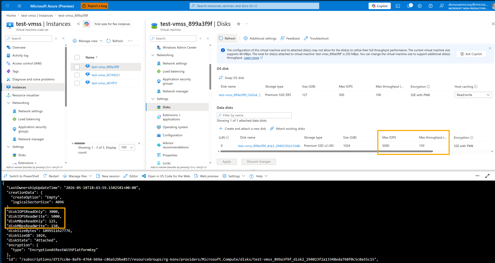

# Manus E2B VMSS Flexible Data Disk IOPS/MBps

## Robin's Testing

### Update

Command:

```cmd
az vmss update \
   -g central-us-amd \
   -n test-vmss \
   --set virtualMachineProfile.storageProfile.dataDisks[0].diskIOPSReadWrite=16000 \
   virtualMachineProfile.storageProfile.dataDisks[0].diskMBpsReadWrite=1000
```

Response:

```json
{
  "additionalCapabilities": {
    "hibernationEnabled": false
  },
  "constrainedMaximumCapacity": false,
  "etag": "\"6\"",
  "highSpeedInterconnectPlacement": "None",
  "id": "/subscriptions/.../resourceGroups/central-us-amd/providers/Microsoft.Compute/virtualMachineScaleSets/test-vmss",
  "location": "centralus",
  "name": "test-vmss",
  "orchestrationMode": "Flexible",
  "platformFaultDomainCount": 1,
  "provisioningState": "Succeeded",
  "resourceGroup": "central-us-amd",
  "scaleInPolicy": {
    "forceDeletion": false,
    "rules": [
      "Default"
    ]
  },
  "singlePlacementGroup": false,
  "sku": {
    "capacity": 0,
    "name": "Standard_E4as_v7",
    "tier": "Standard"
  },
  "timeCreated": "2026-05-12T07:58:47.9250241+00:00",
  "type": "Microsoft.Compute/virtualMachineScaleSets",
  "uniqueId": "986fcb0e-99f0-41da-b58b-a5bf5f804139",
  "upgradePolicy": {
    "mode": "Manual"
  },
  "virtualMachineProfile": {
    "diagnosticsProfile": {
      ...
    },
    "extensionProfile": {
      ...
    },
    "networkProfile": {
      ...
    },
    "osProfile": {
      ...
    },
    "securityProfile": {
      ...
    },
    "storageProfile": {
      "dataDisks": [
        {
          "caching": "None",
          "createOption": "Empty",
          "deleteOption": "Delete",
          "diskIOPSReadWrite": 16000,
          "diskMBpsReadWrite": 1000,
          "diskSizeGB": 1024,
          "lun": 0,
          "managedDisk": {
            "storageAccountType": "PremiumV2_LRS"
          },
          "writeAcceleratorEnabled": false
        }
      ],
      "diskControllerType": "NVMe",
      "imageReference": {
        "offer": "ubuntu-24_04-lts",
        "publisher": "canonical",
        "sku": "server",
        "version": "latest"
      },
      "osDisk": {
        ...
      }
    },
    "timeCreated": "2026-05-12T08:07:36.0277663+00:00"
  },
  "zoneBalance": false,
  "zones": [
    "1",
    "2",
    "3"
  ]
}
```

### Verification

#### Check #1

Command:

```cmd
az vmss show \
   -g central-us-amd \
   -n test-vmss \
   --query "virtualMachineProfile.storageProfile.dataDisks[].{lun:lun, diskSizeGB:diskSizeGB, diskIOPSReadWrite:diskIOPSReadWrite, diskMBpsReadWrite:diskMBpsReadWrite}" \
   -o table
```

Response:

```bash
Lun
-----
0
```

#### Check #2

Command:

```cmd
az vmss show \
   -g central-us-amd \
   -n test-vmss \
   --query "virtualMachineProfile.storageProfile.dataDisks[]" \
   -o json
```

Response:

```json
[
  {
    "caching": "None",
    "createOption": "Empty",
    "deleteOption": "Delete",
    "diskIopsReadWrite": null,
    "diskMBpsReadWrite": null,
    "diskSizeGb": 1024,
    "lun": 0,
    "managedDisk": {
      "diskEncryptionSet": null,
      "securityProfile": null,
      "storageAccountType": "PremiumV2_LRS"
    },
    "name": null,
    "writeAcceleratorEnabled": false
  }
]
```

---

## Donovan's Testing

### Update

Command:

```shell
az vmss update \
  --resource-group "rg-konv" \
  --name "test-vmss" \
  --set \              
    virtualMachineProfile.storageProfile.dataDisks[0].diskIOPSReadWrite=5000 \              
    virtualMachineProfile.storageProfile.dataDisks[0].diskMBpsReadWrite=150
```

Response:

```json
{
  "additionalCapabilities": {
    "hibernationEnabled": false
  },
  "constrainedMaximumCapacity": false,
  "etag": "\"2\"",
  "highSpeedInterconnectPlacement": "None",
  "id": "/subscriptions/.../resourceGroups/rg-konv/providers/Microsoft.Compute/virtualMachineScaleSets/test-vmss",
  "location": "canadacentral",
  "name": "test-vmss",
  "orchestrationMode": "Flexible",
  "platformFaultDomainCount": 1,
  "provisioningState": "Succeeded",
  "resourceGroup": "rg-konv",
  "scaleInPolicy": {
    "forceDeletion": false,
    "rules": [
      "Default"
    ]
  },
  "singlePlacementGroup": false,
  "sku": {
    "capacity": 2,
    "name": "Mix"
  },
  "skuProfile": {
    "allocationStrategy": "CapacityOptimized",
    "vmSizes": [
      {
        "name": "Standard_B2as_v2"
      },
      {
        "name": "Standard_D2s_v3"
      }
    ]
  },
  "timeCreated": "2026-05-18T17:22:08.4855702+00:00",
  "type": "Microsoft.Compute/virtualMachineScaleSets",
  "uniqueId": "c73b2781-cba6-4b89-976d-bf226fa8ad2d",
  "upgradePolicy": {
    "mode": "Manual"
  },
  "virtualMachineProfile": {
    "diagnosticsProfile": {
      ...
    "extensionProfile": {
      ...
    },
    "networkProfile": {
      ...
    },
    "osProfile": {
      "adminUsername": "VMSS-Admin",
      "allowExtensionOperations": true,
      "computerNamePrefix": "test-vmss",
      "requireGuestProvisionSignal": true,
      "secrets": [],
      "windowsConfiguration": {
        "enableAutomaticUpdates": true,
        "enableVMAgentPlatformUpdates": true,
        "patchSettings": {
          "assessmentMode": "ImageDefault",
          "enableHotpatching": false,
          "patchMode": "AutomaticByOS"
        },
        "provisionVMAgent": true
      }
    },
    "storageProfile": {
      "dataDisks": [
        {
          "caching": "None",
          "createOption": "Empty",
          "deleteOption": "Delete",
          "diskIOPSReadWrite": 5000,
          "diskMBpsReadWrite": 150,
          "diskSizeGB": 1024,
          "lun": 0,
          "managedDisk": {
            "storageAccountType": "PremiumV2_LRS"
          },
          "writeAcceleratorEnabled": false
        }
      ],
      "diskControllerType": "SCSI",
      "imageReference": {
        "offer": "WindowsServer",
        "publisher": "MicrosoftWindowsServer",
        "sku": "2025-datacenter-g2",
        "version": "latest"
      },
      "osDisk": {
        "caching": "ReadWrite",
        "createOption": "FromImage",
        "deleteOption": "Delete",
        "diskSizeGB": 127,
        "managedDisk": {
          "storageAccountType": "Premium_ZRS"
        },
        "osType": "Windows"
      }
    },
    "timeCreated": "2026-05-18T17:58:52.352535+00:00"
  },
  "zoneBalance": false,
  "zones": [
    "1",
    "2"
  ]
}
```

### Verification (on VMSS)

#### Check: CLI

Command:

```shell
az vmss show --resource-group "rg-konv" --name "test-vmss" --query "virtualMachineProfile.storageProfile.dataDisks[].{lun:lun,sku:managedDisk.storageAccountType,sizeGB:diskSizeGB,iops:diskIOPSReadWrite,mbps:diskMBpsReadWrite,caching:caching}" --output table
```

Response:

```shell
Lun    Sku            SizeGB    Iops    Mbps    Caching
-----  -------------  --------  ------  ------  ---------
0      PremiumV2_LRS  1024      5000    150     None
```

#### Check: Portal

> [NOTE]
>
> The Azure Portal still shows the default 3000 | 125 settings.



#### Check: Resource JSON

> [NOTE]
>
> The API responses show that the update has been made.



### Verification on Instance

Comparing API responses (portal <--> cloud shell):



Comparing API response to Portal UI:


